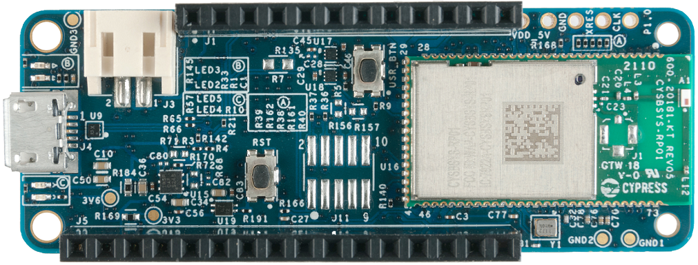

# CYSBSYSKIT-01 BSP

## Overview

CYSBSYSKIT-01: Pre-configured Rapid IoT Connect Platform RP01 Feather Kit with a CYSBSYS-RP01 Rapid IoT Connect module which enables a secure, scalable, and reliable connection to cloud. CYSBSYS-RP01 is a pre-certified 802.11ac-friendly dual- band (2.4 and 5.0 GHz) Wi-Fi and Bluetooth 5.0-compliant combo radio module. 

To use code from the BSP, simply include a reference to `cybsp.h`.

## Features

### Kit Features:

* CYSBSYS-RP01 module with managed firmware for device management and radio chip. 
* 512KB Flash and 512KB SRAM for customer application on CM4
* 512-Mbit external Quad SPI NOR Flash that provides a fast, expandable memory for data and code
* KitProg3 on-board SWD programmer/debugger, USB-UART, and USB-I2C bridge functionality
* A user LED, a user button, and a reset button
* Battery connector, charging IC, and charging indicator LED
* One KitProg3 mode button, one KitProg3 status LED, and one KitProg3 power LED
* OPTIGA Trust M advanced security controller for secure data storage
* Thermistor for sensing the ambient temperature
* 16KB of Emulated EEPROM
* Feather compatible pin header

### Kit Contents:

* CYSBSYSKIT-01 Rapid IoT Connect Platform RP01 Feather Kit

## BSP Configuration

The BSP has a few hooks that allow its behavior to be configured. Some of these items are enabled by default while others must be explicitly enabled. Items enabled by default are specified in the CYSBSYSKIT-01.mk file. The items that are enabled can be changed by creating a custom BSP or by editing the application makefile.

Components:
* Device specific category reference (e.g.: CAT1) - This component, enabled by default, pulls in any device specific code for this board.

Defines:
* CYBSP_WIFI_CAPABLE - This define, disabled by default, causes the BSP to initialize the interface to an onboard wireless chip if it has one.
* CY_USING_HAL - This define, enabled by default, specifies that the HAL is intended to be used by the application. This will cause the BSP to include the applicable header file and to initialize the system level drivers.
* CYBSP_CUSTOM_SYSCLK_PM_CALLBACK - This define, disabled by default, causes the BSP to skip registering its default SysClk Power Management callback, if any, and instead to invoke the application-defined function `cybsp_register_custom_sysclk_pm_callback` to register an application-specific callback.

### Clock Configuration

| Clock    | Source    | Output Frequency |
|----------|-----------|------------------|
| PLL      | IMO       | 100.0 MHz        |
| CLK_HF0  | CLK_PATH1 | 100 MHz          |
| CLK_HF2  | CLK_PATH1 | 50 MHz           |
| CLK_HF4  | CLK_PATH1 | 100 MHz          |

See the [BSP Setttings][settings] for additional board specific configuration settings.

## API Reference Manual

The CYSBSYSKIT-01 Board Support Package provides a set of APIs to configure, initialize and use the board resources.

See the [BSP API Reference Manual][api] for the complete list of the provided interfaces.

## More information
* [CYSBSYSKIT-01 BSP API Reference Manual][api]
* [CYSBSYSKIT-01 Documentation](https://www.infineon.com/cms/en/product/evaluation-boards/CYSBSYSKIT-01)
* [Cypress Semiconductor, an Infineon Technologies Company](http://www.cypress.com)
* [Infineon GitHub](https://github.com/infineon)
* [ModusToolbox™](https://www.cypress.com/products/modustoolbox-software-environment)

[api]: https://infineon.github.io/TARGET_CYSBSYSKIT-01/html/modules.html
[settings]: https://infineon.github.io/TARGET_CYSBSYSKIT-01/html/md_bsp_settings.html

---
© Cypress Semiconductor Corporation (an Infineon company) or an affiliate of Cypress Semiconductor Corporation, 2019-2024.